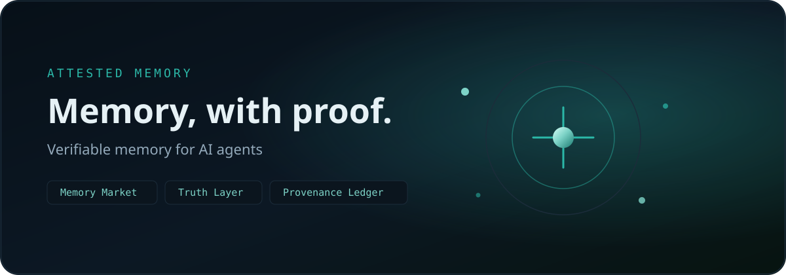

<!-- aicom-mirror-notice -->
> **🔄 Synced from a monorepo — but with a live history.** `attested-memory` mirrors the
> canonical AI-Factory monorepo. History here is append-only (no force-push).
> **Pull requests are welcome** — merged PRs are imported back into the monorepo
> and re-synced here, so your contribution becomes canonical.
> 💬 **[Issues](https://github.com/alexar76/attested-memory/issues)** · **[Pull requests](https://github.com/alexar76/attested-memory/pulls)** both welcome.

<!-- aicom-readme-badges -->
<p align="center">
  <a href="https://github.com/alexar76/attested-memory/actions/workflows/ci.yml"></a>
  <a href="https://github.com/alexar76/attested-memory/actions/workflows/pages.yml"></a>
  <a href="https://alexar76.github.io/attested-memory/"></a>
  <a href="https://attestedmemory.net/"></a>
  <a href="https://github.com/alexar76/attested-memory/tree/main/clients/python"></a>
  =3.11" />
  <a href="https://github.com/alexar76/attested-memory/blob/main/LICENSE"></a>
</p>
<!-- /aicom-readme-badges -->

<p align="center">
  <a href="https://attestedmemory.net/">
    
  </a>
</p>

# Attested Memory Hub

<p align="center">
  <strong>Attested Memory</strong> — verifiable memory for AI agents<br>
  Memory Market · Truth Layer · Provenance Ledger · one Memory Unit contract
</p>

<p align="center">
  <a href="https://alexar76.github.io/attested-memory/"><b>Landing</b></a> ·
  <a href="https://attestedmemory.net/">Live site</a> ·
  <a href="https://github.com/alexar76/attested-memory/actions/workflows/pages.yml">GitHub Pages</a> ·
  <a href="clients/python">clients/python</a>
</p>

Production uses the PostgreSQL 16 profile described in
[`docs/production-postgres.md`](docs/production-postgres.md). Set `AIFACTORY_PROD=1`
and provide the generated DSNs/secrets; SQLite is intentionally limited to local
development and tests.

Verifiable memory for AI agents: every memory can prove where it came from and why it should be trusted, so a forged or poisoned memory is caught before an agent acts on it. Part of the open [AIMarket](https://modelmarket.dev) ecosystem; it runs as its own AIMarket-compatible Hub and federates with other hubs.

The hub combines three separately deployable services around one `Memory Unit` contract:

| Service | Role | Core capabilities |
| --- | --- | --- |
| [`memory-market`](memory-market/) | Primary product: store, find, share and price portable agent memory | `memory.write`, `memory.read`, `memory.search`, `memory.share`, `memory.score` |
| [`truth-layer`](truth-layer/) | Evidence and contradiction analysis | `memory.verify`, `claim.check`, `contradiction.scan`, `evidence.pack` |
| [`provenance-ledger`](provenance-ledger/) | Append-only lineage and signed receipts | `memory.attest`, `lineage.get`, `receipt.verify` |

The market is the product wedge. Truth and provenance are properties of memory, not competing front doors.

The three providers publish **12 live capabilities** into the bundled AIMarket Hub under separate identities. Its signed `ecosystem.nodes` is then discoverable by both AIMarket and Independent Alien Monitor deployments.

Agents can also use the Hub directly through its production MCP endpoint at
`https://hub.attestedmemory.net/mcp`. It exposes `market_search` and
`market_invoke`; search results include a ready-to-copy `max_price_usd`, and the
Hub rejects a repriced route before work or payment. See [MCP access](docs/mcp.md).

## Run the hub

Requirements: Docker Compose v2, Git and OpenSSL.

```bash
./start.sh
```

`start.sh` calls `scripts/ensure_env.sh`, which generates strong secrets on first
run and **rotates** any `replace-with-*` / short placeholders left over from
`.env.example`. `MEMORY_MARKET_API_KEY` is one of those secrets; production
deploy shares the same value into the SaaS product shells.

For a production host (HTTPS URLs, KOVA, payment recipient, SaaS edge):

```bash
./scripts/deploy_attested_memory.sh   # maintainers: lives in the AIMarket monorepo; see its header
```

- Market console and API: <http://127.0.0.1:8810>
- AIMarket-compatible Hub: <http://127.0.0.1:9084>
- Truth API docs: <http://127.0.0.1:8811/docs>
- Provenance API docs: <http://127.0.0.1:8812/docs>

`start.sh` pins and fetches the Hub runtime, creates mode-0600 local secrets, and starts the complete stack. Data and signing keys are stored in named Docker volumes. Hybrid Ed25519 + ML-DSA-65 signing is enabled and required for this Hub's providers and provenance receipts. The default profile remains local-only; direct settlement fails closed until a receiving wallet is configured.

## Direct wallet payments

Set the operator's public Base address in `.env` and restart the stack:

```dotenv
PAYMENT_RECIPIENT=0xYour40HexCharacterBaseAddress
```

Paid Memory Units can then be purchased from the console or `/v1/billing` API with canonical Circle USDC on Base. Funds go directly to that address; the service has no private key. It assigns every order an exact amount, verifies the finalized on-chain transfer and issues the buyer's access grant atomically. See [the payment guide](docs/payments.md) before enabling it in production.

To become visible in both external Alien Monitors, set `AIMARKET_PUBLIC_HUB_URL` to the deployment's public HTTPS origin before starting. The bootstrap announces to `modelmarket.dev` and `independentai.network`; operators of those roots must still approve and pin the peer. See [Alien Monitor integration](integrations/alien-monitor/README.md).

## Development

Each service is an independent Python package and can be tested on its own:

```bash
./scripts/check.sh
```

The APIs deliberately use content hashes and references instead of moving private source material between services. See [architecture](docs/architecture.md), [capabilities](docs/capabilities.md), [security](docs/security.md), [payments](docs/payments.md), and [monetization](docs/monetization.md).

Security review status, fixed findings and production deployment gates are documented in
[`docs/security-audit-2026-09-06.md`](docs/security-audit-2026-09-06.md).

## Source and contributions

Developed in the AIMarket monorepo and published as
[`alexar76/attested-memory`](https://github.com/alexar76/attested-memory). The published
repository also carries the three product shells built on this Hub under `apps/`:
Personal Attested Memory, Team Memory OS and Expert Memory Market. Issues and pull
requests are welcome there.

## Status

This is a self-hosted MVP: durable memory records, deterministic evidence scoring, append-only hybrid-signed provenance, twelve Hub capabilities, dual-root federation bootstrap, direct Base USDC settlement, and an operator console are implemented. Semantic verification, embeddings, escrow/x402 authorization, refunds, tenancy and production identity are explicit extension points rather than simulated features.

## License

Apache-2.0. See [LICENSE](LICENSE).
