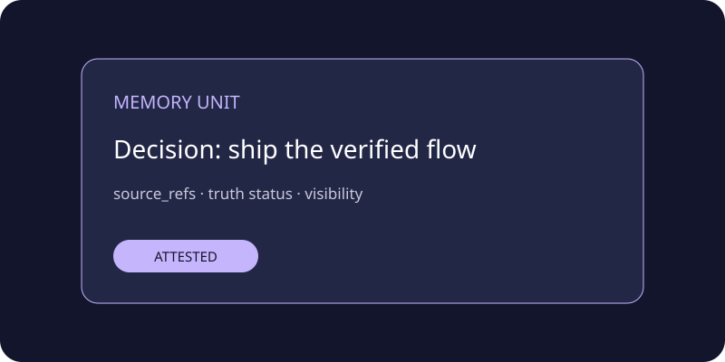
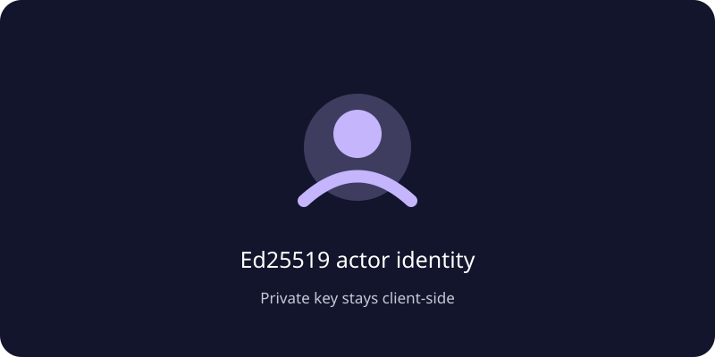
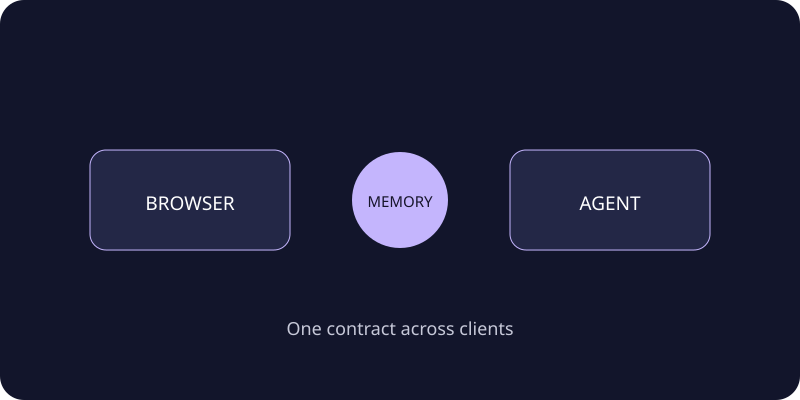

# Personal Attested Memory

> A durable second brain for people and agents, with signed context and provenance.

<p>
  
  
  
</p>

<p align="center"></p>

## Gallery

| Memory Unit | Actor identity | Portability |
| --- | --- | --- |
|  |  |  |

Personal Attested Memory is a small FastAPI product shell over an Attested
Memory Hub. It lets a person or agent write, search and read source-linked
Memory Units while the Hub handles actor verification, Truth status and
Provenance.

## Features

- private memory write, search and read routes;
- Ed25519 actor headers on protected requests;
- scoped `X-SaaS-Key` checked by the Gateway;
- the same Memory Unit contract for browser, API and MCP clients;
- no wallet private keys at the product edge;
- PostgreSQL-backed Hub integration in production.

## Quick start

```bash
python -m venv .venv && source .venv/bin/activate
pip install -e ".[dev]"
cp .env.example .env
uvicorn personal_memory.app:app --app-dir src --port 9410
```

Or build the container:

```bash
docker build -t personal-attested-memory .
docker run --env-file .env -p 9410:9410 personal-attested-memory
```

The product needs a reachable Memory Market and SaaS Gateway. Configure them
with `MEMORY_MARKET_URL`, `MEMORY_MARKET_API_KEY`, `SAAS_GATEWAY_URL` and
`SAAS_GATEWAY_API_KEY`.

## API surface

- `GET /healthz`
- `GET /api/search?q=...&limit=...`
- `POST /api/memories`
- `GET /api/memories/{memory_id}`

Protected calls require `X-SaaS-Key`, `X-Actor-ID`, `X-Actor-Public-Key` and
`X-Actor-Signature`. See [`docs/api.md`](docs/api.md).

## Production boundary

Run behind TLS and an edge rate limiter. Keep the actor private key in the
client or agent runtime. See [`docs/deploy.md`](docs/deploy.md) and
[`SECURITY.md`](SECURITY.md).

## License

MIT — see [`LICENSE`](LICENSE).
