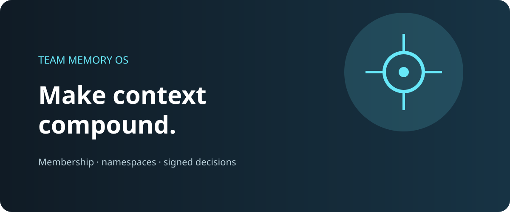
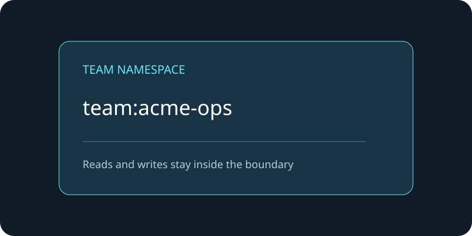
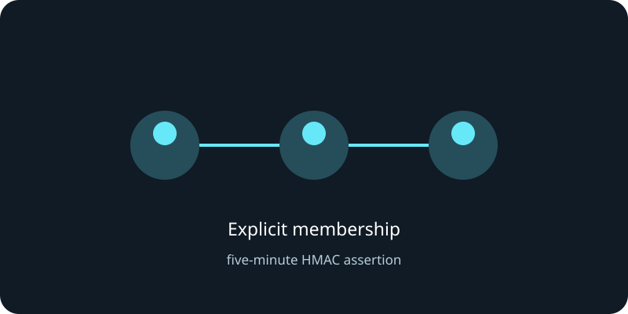
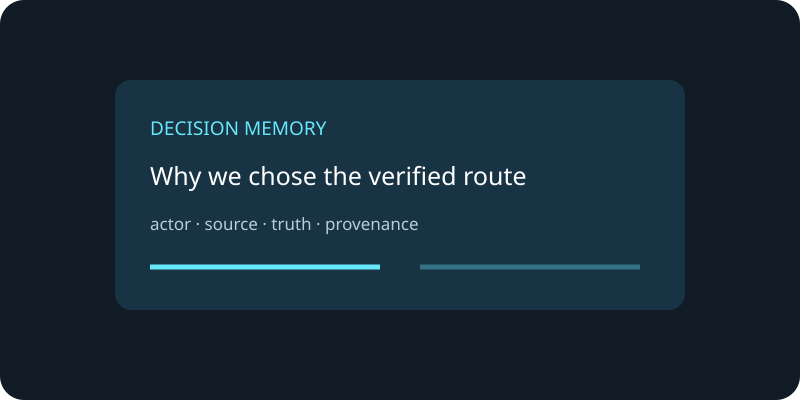

# Team Memory OS

> Shared company memory with explicit membership, bounded namespaces and signed decisions.

<p>
  
  
  
</p>

<p align="center"></p>

## Gallery

| Namespace | Membership | Decisions |
| --- | --- | --- |
|  |  |  |

Team Memory OS is a FastAPI product shell over an Attested Memory Hub. It
combines Gateway-managed membership with cryptographic actor identity so a
team boundary is enforced both at the SaaS edge and inside the Hub.

## Features

- create teams and manage members;
- team-scoped memory write, search and read;
- `team:<id>` namespace isolation;
- five-minute HMAC assertions for active members;
- Ed25519 actor signatures remain mandatory;
- PostgreSQL-backed membership and production Hub integration.

## Quick start

```bash
python -m venv .venv && source .venv/bin/activate
pip install -e ".[dev]"
cp .env.example .env
uvicorn team_memory.app:app --app-dir src --port 9420
```

Or build the container:

```bash
docker build -t team-memory-os .
docker run --env-file .env -p 9420:9420 team-memory-os
```

The product needs a reachable Memory Market and SaaS Gateway. Configure
`MEMORY_MARKET_URL`, `MEMORY_MARKET_API_KEY`, `SAAS_GATEWAY_URL` and
`SAAS_GATEWAY_API_KEY`.

## API surface

- `GET /healthz`
- `POST /api/teams`
- `POST /api/teams/{team_id}/members`
- `DELETE /api/teams/{team_id}/members/{actor_id}`
- `POST /api/team-memories`
- `GET /api/team-search?team_id=...`
- `GET /api/team-memories/{memory_id}?team_id=...`

Protected memory calls require `X-SaaS-Key`, actor headers and a valid team
membership. See [`docs/api.md`](docs/api.md).

## Production boundary

Run behind TLS, an edge rate limiter and a secret manager. Revoke the SaaS key
for immediate offboarding; team assertions expire after five minutes. See
[`docs/deploy.md`](docs/deploy.md) and [`SECURITY.md`](SECURITY.md).

## License

MIT — see [`LICENSE`](LICENSE).
